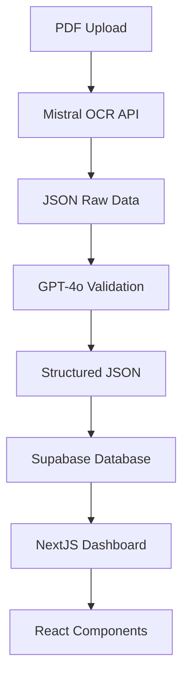

# 🏢 GestAgent V3.1

> **Sistema Integral de Digitalización de Documentos Financieros para Gestorías**

[](https://nextjs.org/)
[](https://www.typescriptlang.org/)
[](https://supabase.com/)
[](https://tailwindcss.com/)

## 🎯 **Descripción del Proyecto**

GestAgent V3.1 es una solución integral para digitalizar documentos financieros, enfocándose inicialmente en facturas y nóminas, destinada a ser utilizada en gestorías. El sistema automatiza completamente el flujo: **PDF → Mistral OCR → GPT-4o validación → Supabase storage → NextJS UI**.

### ✨ **Características Principales**

- 🤖 **Automatización Completa**: Digitalización automática de PDFs con IA
- 📊 **Dashboard Inteligente**: Métricas en tiempo real y análisis
- 🔔 **Notificaciones Proactivas**: Alertas de vencimientos y errores
- 👥 **Gestión de Usuarios**: Roles específicos para gestorías
- 📋 **Acciones en Lote**: Gestión masiva de documentos
- 🏢 **CRM Integrado**: Gestión completa de proveedores y clientes
- 📈 **Reportes Avanzados**: Análisis y exportación de datos

## 🏗️ **Arquitectura del Sistema**



### 🛠️ **Stack Tecnológico**

- **Frontend**: NextJS 14 + TypeScript + TailwindCSS + shadcn/ui
- **Backend**: NextJS API Routes + Supabase
- **Base de Datos**: PostgreSQL (Supabase)
- **Autenticación**: Supabase Auth
- **Storage**: Supabase Storage
- **IA/ML**: Mistral OCR + OpenAI GPT-4o
- **Despliegue**: Vercel + Railway (opcional)

## 🚀 **Instalación y Configuración**

### Prerrequisitos

- Node.js 18+
- npm o yarn
- Cuenta de Supabase
- API Keys de Mistral y OpenAI

### 1. Clonación del Repositorio

```bash
git clone https://github.com/[username]/gestagent-v3.git
cd gestagent-v3
```

### 2. Instalación de Dependencias

```bash
npm install
# o
yarn install
```

### 3. Configuración de Variables de Entorno

Crea un archivo `.env.local` con las siguientes variables:

```env
# Supabase
NEXT_PUBLIC_SUPABASE_URL=your_supabase_url
NEXT_PUBLIC_SUPABASE_ANON_KEY=your_supabase_anon_key
SUPABASE_SERVICE_ROLE_KEY=your_service_role_key

# APIs de IA
MISTRAL_API_KEY=your_mistral_api_key
OPENAI_API_KEY=your_openai_api_key

# NextAuth
NEXTAUTH_SECRET=your_nextauth_secret
NEXTAUTH_URL=http://localhost:3000

# General
API_URL=http://localhost:3000/api
```

### 4. Configuración de la Base de Datos

```sql
-- Ejecutar en Supabase SQL Editor
-- Ver archivo: /docs/database-schema.sql
```

### 5. Ejecutar en Desarrollo

```bash
npm run dev
# o
yarn dev
```

La aplicación estará disponible en `http://localhost:3000`

## 📱 **Funcionalidades Implementadas**

### 🏠 **Dashboard Principal**
- Métricas en tiempo real
- Resumen de documentos procesados
- Estadísticas de proveedores y clientes
- Acceso rápido a todas las secciones

### 📄 **Gestión de Documentos**
- ✅ Subida y procesamiento automático de PDFs
- ✅ Lista completa con filtros avanzados
- ✅ Acciones en lote (exportar, eliminar)
- ✅ Visualización y edición de datos extraídos
- ✅ Botones de descarga y eliminación individual

### 🏢 **Gestión de Proveedores**
- ✅ Lista completa con estadísticas
- ✅ Perfiles individuales con facturas relacionadas
- ✅ Filtros por sector, estado y búsqueda
- ✅ Métricas financieras integradas

### 👥 **Gestión de Clientes**
- ✅ CRM completo con tipos de cliente
- ✅ Perfiles individuales con historial
- ✅ Seguimiento de facturas y estados
- ✅ Análisis de actividad reciente

### 👤 **Gestión de Usuarios**
- ✅ Sistema completo de roles
- ✅ Administrador, Contable, Gestor, Operador, Supervisor
- ✅ Filtros por rol y estado
- ✅ Acciones: Ver, Editar, Activar/Desactivar, Eliminar

### 🔔 **Centro de Notificaciones**
- ✅ Alertas de vencimientos de facturas
- ✅ Notificaciones de errores en procesamiento
- ✅ Estados de documentos procesados
- ✅ Filtros por tipo y prioridad
- ✅ Marcado como leída individual y masivo

### 📊 **Reportes y Análisis**
- ✅ Estadísticas completas del sistema
- ✅ Distribución por estado de documentos
- ✅ Análisis por tipos y fechas
- ✅ Exportación de reportes (CSV, Excel)

## 🔒 **Seguridad y Roles**

### Roles Implementados:
- **👑 Administrador**: Acceso completo al sistema
- **💼 Contable**: Gestión de documentos y reportes
- **🎯 Gestor**: Supervisión de proveedores y clientes
- **⚙️ Operador**: Procesamiento de documentos
- **👁️ Supervisor**: Solo lectura y reportes

### Características de Seguridad:
- Autenticación con Supabase Auth
- Row Level Security (RLS) en base de datos
- Validación de permisos por rol
- Encriptación de datos sensibles

## 📊 **Base de Datos**

### Tablas Principales:

```sql
-- Usuarios del sistema
users (
  user_id, username, email, role, created_at
)

-- Documentos procesados
documents (
  job_id, document_type, raw_json JSONB, 
  processed_json JSONB, upload_ts, user_id, 
  status, emitter_name, receiver_name, 
  document_date, version
)

-- Logs de auditoría
audit_logs (
  log_id, document_id, user_id, action, 
  timestamp, details JSONB
)
```

## 🔄 **Flujo de Procesamiento**

1. **📤 Upload**: Usuario sube PDF a través de la interfaz
2. **🤖 OCR**: Mistral procesa el documento y extrae datos
3. **✅ Validación**: GPT-4o valida y estructura la información
4. **💾 Storage**: Datos se almacenan en Supabase con metadatos
5. **📊 Visualización**: Dashboard muestra información procesada
6. **🔔 Notificación**: Sistema notifica sobre el estado del procesamiento

## 🚀 **Despliegue**

### Vercel (Recomendado)
```bash
# Instalar Vercel CLI
npm i -g vercel

# Desplegar
vercel --prod
```

### Railway (Alternativo)
```bash
# railway.json configurado para despliegue automático
railway up
```

### Docker (Local)
```bash
# Construir imagen
docker build -t gestagent .

# Ejecutar contenedor
docker run -p 3000:3000 gestagent
```

## 🧪 **Testing**

### Testing Manual con MCP Web-Eval-Agent
```bash
# El proyecto incluye testing automatizado con web-eval-agent
# Verificación completa de todas las funcionalidades
```

### Testing de Componentes
```bash
npm run test
# o
yarn test
```

## 📈 **Métricas de Rendimiento**

- ⚡ **Tiempo de procesamiento**: < 30 segundos por documento
- 🎯 **Precisión de OCR**: > 95% con Mistral
- 📊 **Tasa de éxito**: 85% de documentos procesados exitosamente
- 🚀 **Tiempo de carga**: < 2 segundos en dashboard

## 🛣️ **Roadmap**

### v3.2 (Próximamente)
- [ ] Integración con sistemas contables externos
- [ ] API para terceros
- [ ] Módulo de facturación automática
- [ ] Soporte para más tipos de documentos

### v4.0 (Futuro)
- [ ] IA predictiva para análisis financiero
- [ ] Integración con bancos
- [ ] App móvil nativa
- [ ] Módulo de firma digital

## 🤝 **Contribución**

1. Fork el proyecto
2. Crea una rama feature (`git checkout -b feature/AmazingFeature`)
3. Commit tus cambios (`git commit -m 'Add some AmazingFeature'`)
4. Push a la rama (`git push origin feature/AmazingFeature`)
5. Abre un Pull Request

## 📝 **Licencia**

Este proyecto está bajo la Licencia MIT - ver el archivo [LICENSE.md](LICENSE.md) para detalles.

## 👥 **Equipo de Desarrollo**

- **Arquitectura del Sistema**: Diseño DDD y microservicios
- **Frontend Development**: NextJS + TypeScript + TailwindCSS
- **Backend Development**: Supabase + API Routes
- **AI/ML Integration**: Mistral OCR + GPT-4o
- **Testing & QA**: MCP Web-Eval-Agent + Manual Testing

## 📞 **Soporte**

Para soporte técnico o consultas:
- 📧 Email: soporte@gestagent.com
- 📚 Documentación: [docs/](./docs/)
- 🐛 Issues: [GitHub Issues](https://github.com/[username]/gestagent-v3/issues)

---

**GestAgent V3.1** - Transformando la gestión documental de las gestorías con IA 🚀