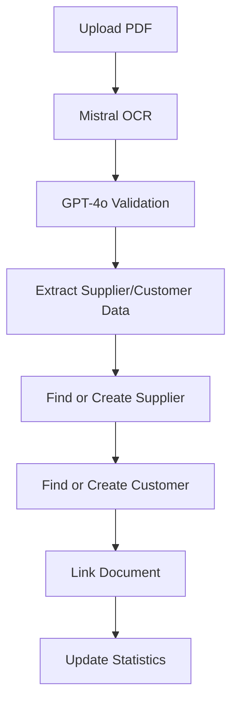

# 🏢 Sistema de Gestión de Proveedores y Clientes

## 📋 Descripción General

El Sistema de Gestión de Proveedores y Clientes es una funcionalidad avanzada de GestAgent que **extrae automáticamente** información de proveedores y clientes desde las facturas procesadas, creando un **registro centralizado** de todas las relaciones comerciales detectadas.

### ✨ Características Principales

- **Extracción Automática**: Al procesar facturas, el sistema detecta y almacena automáticamente proveedores y clientes
- **Deduplicación Inteligente**: Evita duplicados usando NIF/CIF y nombres similares
- **Historial Completo**: Cada proveedor/cliente tiene acceso a su historial de facturas
- **Estadísticas en Tiempo Real**: Cálculo automático de totales, promedios y métricas
- **Búsqueda y Filtrado**: Herramientas avanzadas para encontrar y organizar contactos
- **Gestión Manual**: Posibilidad de editar y crear proveedores/clientes manualmente

---

## 🏗️ Arquitectura del Sistema

### **1. Base de Datos (Supabase)**

#### Tabla `suppliers` (Proveedores)
```sql
CREATE TABLE suppliers (
    supplier_id UUID PRIMARY KEY DEFAULT gen_random_uuid(),
    name VARCHAR(255) NOT NULL,
    nif_cif VARCHAR(20),
    commercial_name VARCHAR(255),
    address TEXT,
    postal_code VARCHAR(10),
    city VARCHAR(100),
    province VARCHAR(100),
    phone VARCHAR(20),
    email VARCHAR(100),
    business_sector VARCHAR(100),
    company_size VARCHAR(20),
    status VARCHAR(20) DEFAULT 'active',
    notes TEXT,
    first_detected_at TIMESTAMP WITH TIME ZONE DEFAULT NOW(),
    last_update_at TIMESTAMP WITH TIME ZONE DEFAULT NOW(),
    created_at TIMESTAMP WITH TIME ZONE DEFAULT NOW(),
    updated_at TIMESTAMP WITH TIME ZONE DEFAULT NOW()
);
```

#### Tabla `customers` (Clientes)
```sql
CREATE TABLE customers (
    customer_id UUID PRIMARY KEY DEFAULT gen_random_uuid(),
    name VARCHAR(255) NOT NULL,
    nif_cif VARCHAR(20),
    commercial_name VARCHAR(255),
    address TEXT,
    postal_code VARCHAR(10),
    city VARCHAR(100),
    province VARCHAR(100),
    phone VARCHAR(20),
    email VARCHAR(100),
    customer_type VARCHAR(20) DEFAULT 'company',
    payment_terms VARCHAR(100),
    credit_limit DECIMAL(15,2),
    status VARCHAR(20) DEFAULT 'active',
    notes TEXT,
    first_detected_at TIMESTAMP WITH TIME ZONE DEFAULT NOW(),
    created_at TIMESTAMP WITH TIME ZONE DEFAULT NOW(),
    updated_at TIMESTAMP WITH TIME ZONE DEFAULT NOW()
);
```

#### Vista `suppliers_with_stats` 
```sql
CREATE VIEW suppliers_with_stats AS
SELECT 
    s.*,
    COALESCE(d.total_invoices, 0) as total_invoices,
    COALESCE(d.total_amount, 0) as total_amount,
    COALESCE(d.total_tax, 0) as total_tax,
    d.last_invoice_date,
    CASE 
        WHEN d.last_invoice_date >= NOW() - INTERVAL '30 days' THEN 'reciente'
        WHEN d.last_invoice_date >= NOW() - INTERVAL '90 days' THEN 'activo'
        ELSE 'inactivo'
    END as activity_status,
    CASE 
        WHEN COALESCE(d.total_amount, 0) > 10000 THEN 'alto'
        WHEN COALESCE(d.total_amount, 0) > 5000 THEN 'medio'
        ELSE 'bajo'
    END as volume_category
FROM suppliers s
LEFT JOIN (
    SELECT 
        supplier_id,
        COUNT(*) as total_invoices,
        SUM(total_amount) as total_amount,
        SUM(tax_amount) as total_tax,
        MAX(document_date) as last_invoice_date
    FROM documents
    WHERE supplier_id IS NOT NULL
    GROUP BY supplier_id
) d ON s.supplier_id = d.supplier_id;
```

### **2. Servicio de Gestión (`suppliers-customers-manager.ts`)**

#### Funciones Principales:

- **`processAndLinkSupplierCustomer()`**: Función principal llamada desde el endpoint de upload
- **`findOrCreateSupplier()`**: Busca proveedor existente o crea nuevo
- **`findOrCreateCustomer()`**: Busca cliente existente o crea nuevo
- **`calculateSimilarity()`**: Algoritmo de comparación de nombres
- **`updateDocumentReferences()`**: Vincula documento con proveedor/cliente

#### Algoritmo de Deduplicación:
1. **Búsqueda exacta por NIF/CIF** (si existe)
2. **Búsqueda por similitud de nombre** (threshold 80%)
3. **Creación de nuevo registro** si no hay coincidencias

---

## 🔌 API Endpoints

### **Proveedores**

#### `GET /api/suppliers`
Lista proveedores con filtros y paginación
```typescript
Query Parameters:
- search: string (buscar en nombre/NIF)
- status: 'active' | 'inactive' | 'all'
- sector: string (filtro por sector)
- sortBy: 'name' | 'total_amount' | 'total_invoices' | 'last_invoice_date'
- sortOrder: 'asc' | 'desc'
- page: number
- limit: number
```

#### `GET /api/suppliers/[id]`
Detalles de proveedor específico con historial de facturas

#### `PUT /api/suppliers/[id]`
Actualizar información de proveedor

#### `DELETE /api/suppliers/[id]`
Desactivar proveedor (soft delete)

### **Clientes**

#### `GET /api/customers`
Lista clientes con filtros y paginación

#### `GET /api/customers/[id]`
Detalles de cliente específico

#### `PUT /api/customers/[id]`
Actualizar cliente

#### `DELETE /api/customers/[id]`
Desactivar cliente

---

## 🖥️ Interfaz de Usuario

### **Página Principal de Proveedores** (`/dashboard/suppliers`)

#### Componentes:
- **Estadísticas en Tiempo Real**: Cards con métricas clave
- **Filtros Avanzados**: Búsqueda, estado, sector, ordenamiento
- **Tabla Responsiva**: Lista completa con paginación
- **Indicadores Visuales**: Estado de actividad y volumen

#### Funcionalidades:
- ✅ Búsqueda en tiempo real
- ✅ Filtrado múltiple
- ✅ Ordenamiento dinámico
- ✅ Paginación
- ✅ Estados visuales (activo/inactivo, volumen alto/medio/bajo)

### **Página de Detalles** (`/dashboard/suppliers/[id]`)
- Información completa del proveedor
- Historial de facturas asociadas
- Estadísticas por mes/año
- Gráficos de actividad comercial
- Formulario de edición

---

## 🔄 Flujo de Procesamiento

### **1. Upload de Factura**


### **2. Algoritmo de Matching**
```typescript
1. Buscar por NIF/CIF exacto
   ↓ (si no encuentra)
2. Buscar por nombre similar (>80% similitud)
   ↓ (si no encuentra)
3. Crear nuevo registro
   ↓
4. Vincular documento
5. Actualizar estadísticas
```

---

## 📊 Estadísticas y Métricas

### **Automáticas**
- **Total Facturas**: Número de documentos por proveedor/cliente
- **Importe Total**: Suma de todos los importes
- **Importe Promedio**: Promedio por factura
- **Última Factura**: Fecha del último documento
- **Estado de Actividad**: Basado en fecha última factura
- **Categoría de Volumen**: Basado en importe total

### **Categorización Automática**

#### Estado de Actividad:
- **Reciente**: Facturas en los últimos 30 días
- **Activo**: Facturas en los últimos 90 días
- **Inactivo**: Sin facturas recientes

#### Volumen Comercial:
- **Alto**: > €10,000 total
- **Medio**: €5,000 - €10,000
- **Bajo**: < €5,000

---

## 🚀 Instalación y Configuración

### **1. Ejecutar Migraciones SQL**
```bash
# En Supabase SQL Editor, ejecutar:
database/supabase-schema.sql
```

### **2. Configurar Variables de Entorno**
```env
NEXT_PUBLIC_SUPABASE_URL=your_supabase_url
SUPABASE_SERVICE_ROLE_KEY=your_service_role_key
```

### **3. Integrar en Flujo Existente**
El sistema se integra automáticamente cuando se activa en el endpoint de upload:

```typescript
// En app/api/documents/upload/route.ts
import { suppliersCustomersManager } from '@/services/suppliers-customers-manager';

// Después de procesar la factura...
const linkedData = await suppliersCustomersManager.processAndLinkSupplierCustomer(
  extractedData,
  jobId,
  userId
);
```

---

## 🎯 Casos de Uso

### **Para Gestorías**
1. **Gestión Centralizada**: Un solo lugar para ver todos los proveedores/clientes
2. **Análisis de Relaciones**: Identificar principales colaboradores comerciales
3. **Seguimiento de Actividad**: Detectar cambios en patrones de facturación
4. **Exportación de Datos**: Listas para sistemas contables externos

### **Para Usuarios Finales**
1. **Navegación Intuitiva**: Encontrar facturas por proveedor/cliente
2. **Estadísticas Personales**: Ver gastos/ingresos por relación
3. **Búsqueda Rápida**: Filtros para localizar información específica
4. **Historial Completo**: Acceso a todo el registro comercial

---

## 🔮 Extensiones Futuras

### **Fase 2**
- **Dashboard Analítico**: Gráficos de tendencias y comparativas
- **Alertas Inteligentes**: Notificaciones de cambios importantes
- **Exportación Avanzada**: Reportes personalizados
- **API Externa**: Integración con sistemas contables

### **Fase 3**
- **Machine Learning**: Predicción de patrones comerciales
- **Geolocalización**: Mapas de proveedores/clientes
- **CRM Básico**: Gestión de contactos y seguimiento
- **Automatización**: Reglas de negocio personalizables

---

## ✅ Estado Actual

### **Implementado ✅**
- [x] Tablas de base de datos
- [x] Servicio de gestión automática
- [x] APIs RESTful completas
- [x] Página de lista de proveedores
- [x] Sistema de deduplicación
- [x] Integración con proceso de upload

### **Pendiente 🔄**
- [ ] Página de detalles de proveedor
- [ ] Página de gestión de clientes
- [ ] Formularios de edición
- [ ] Testing end-to-end
- [ ] Documentación de usuario

---

## 🏁 Conclusión

El Sistema de Gestión de Proveedores y Clientes representa un **salto cualitativo** en GestAgent, transformando el procesamiento de facturas individuales en una **solución integral de gestión comercial**. 

La automatización inteligente reduce el trabajo manual mientras proporciona insights valiosos sobre las relaciones comerciales, convirtiendo GestAgent en una herramienta indispensable para gestorías modernas.

**¡El futuro de la digitalización documental comienza aquí! 🚀** 