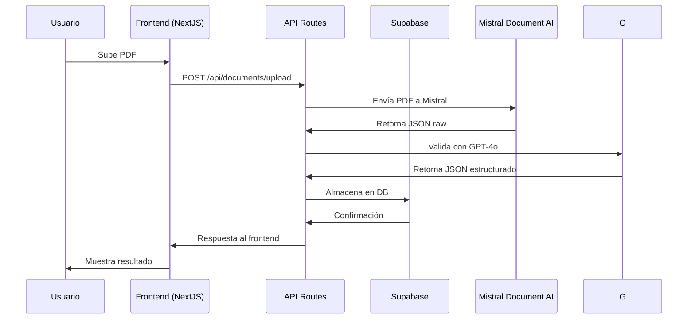

# 🔧 Documentación Técnica - GestAgent V3.1

## 📚 **Índice**
1. [Arquitectura del Sistema](#arquitectura-del-sistema)
2. [Base de Datos](#base-de-datos)
3. [APIs y Endpoints](#apis-y-endpoints)
4. [Autenticación y Seguridad](#autenticación-y-seguridad)
5. [Integración con IA](#integración-con-ia)
6. [Frontend Architecture](#frontend-architecture)
7. [Testing Strategy](#testing-strategy)
8. [Performance](#performance)
9. [Deployment](#deployment)

---

## 🏗️ **Arquitectura del Sistema**

### **Patrón de Arquitectura: Domain-Driven Design (DDD)**

```
gestagent/
├── app/                    # Next.js App Router
│   ├── api/               # API Routes (Backend)
│   ├── dashboard/         # Dashboard Pages
│   └── auth/             # Authentication Pages
├── domain/               # Domain Layer (DDD)
├── application/          # Application Layer
├── infrastructure/       # Infrastructure Layer
├── components/           # UI Components
└── services/            # External Services
```

### **Flujo de Datos**



---

## 🗄️ **Base de Datos**

### **Esquema de Supabase PostgreSQL**

#### **Tabla: users**
```sql
CREATE TABLE users (
    user_id UUID PRIMARY KEY DEFAULT gen_random_uuid(),
    username VARCHAR(50) UNIQUE NOT NULL,
    email VARCHAR(255) UNIQUE NOT NULL,
    role VARCHAR(20) NOT NULL CHECK (role IN ('admin', 'contable', 'gestor', 'operador', 'supervisor')),
    created_at TIMESTAMP WITH TIME ZONE DEFAULT NOW(),
    phone VARCHAR(20),
    department VARCHAR(100),
    status VARCHAR(20) DEFAULT 'active' CHECK (status IN ('active', 'inactive', 'pending')),
    last_login TIMESTAMP WITH TIME ZONE
);
```

#### **Tabla: documents**
```sql
CREATE TABLE documents (
    job_id UUID PRIMARY KEY DEFAULT gen_random_uuid(),
    document_type VARCHAR(50) NOT NULL,
    raw_json JSONB,
    processed_json JSONB NOT NULL,
    upload_timestamp TIMESTAMP WITH TIME ZONE DEFAULT NOW(),
    user_id UUID REFERENCES users(user_id),
    status VARCHAR(20) DEFAULT 'pending',
    emitter_name VARCHAR(255),
    receiver_name VARCHAR(255),
    document_date DATE,
    total_amount DECIMAL(12,2),
    currency VARCHAR(3) DEFAULT 'EUR',
    version INTEGER DEFAULT 1,
    file_path TEXT
);
```

#### **Tabla: audit_logs**
```sql
CREATE TABLE audit_logs (
    log_id UUID PRIMARY KEY DEFAULT gen_random_uuid(),
    document_id UUID REFERENCES documents(job_id),
    user_id UUID REFERENCES users(user_id),
    action VARCHAR(50) NOT NULL,
    timestamp TIMESTAMP WITH TIME ZONE DEFAULT NOW(),
    details JSONB,
    ip_address INET
);
```

### **Índices para Performance**
```sql
-- Índices GIN para JSONB
CREATE INDEX idx_documents_raw_json ON documents USING GIN (raw_json);
CREATE INDEX idx_documents_processed_json ON documents USING GIN (processed_json);

-- Índices B-tree para columnas denormalizadas
CREATE INDEX idx_documents_emitter_name ON documents (emitter_name);
CREATE INDEX idx_documents_document_date ON documents (document_date);
CREATE INDEX idx_documents_status ON documents (status);
CREATE INDEX idx_documents_user_id ON documents (user_id);
```

---

## 🔌 **APIs y Endpoints**

### **Autenticación**
```typescript
// POST /api/auth/register
interface RegisterRequest {
  username: string;
  email: string;
  password: string;
  role: 'admin' | 'contable' | 'gestor' | 'operador' | 'supervisor';
}

// POST /api/auth/login
interface LoginRequest {
  email: string;
  password: string;
}

// GET /api/auth/user
interface UserResponse {
  user_id: string;
  username: string;
  email: string;
  role: string;
}
```

### **Gestión de Documentos**
```typescript
// POST /api/documents/upload
interface UploadRequest {
  file: File;
  document_type: string;
}

interface UploadResponse {
  job_id: string;
  status: 'processing' | 'completed' | 'error';
  message: string;
}

// GET /api/documents/data/[jobId]
interface DocumentResponse {
  job_id: string;
  document_type: string;
  processed_json: any;
  status: string;
  emitter_name: string;
  receiver_name: string;
  document_date: string;
  total_amount: number;
}
```

### **Acciones en Lote**
```typescript
// POST /api/documents/bulk-delete
interface BulkDeleteRequest {
  document_ids: string[];
}

// POST /api/documents/bulk-export
interface BulkExportRequest {
  document_ids: string[];
  format: 'csv' | 'excel' | 'json';
}
```

---

## 🔐 **Autenticación y Seguridad**

### **Supabase Auth Configuration**
```typescript
// lib/supabase.ts
import { createClient } from '@supabase/supabase-js'

const supabaseUrl = process.env.NEXT_PUBLIC_SUPABASE_URL!
const supabaseAnonKey = process.env.NEXT_PUBLIC_SUPABASE_ANON_KEY!

export const supabase = createClient(supabaseUrl, supabaseAnonKey)
```

### **Row Level Security (RLS)**
```sql
-- Habilitar RLS en documentos
ALTER TABLE documents ENABLE ROW LEVEL SECURITY;

-- Policy: Los usuarios solo pueden ver sus propios documentos
CREATE POLICY "Users can view own documents" ON documents
    FOR SELECT USING (auth.uid() = user_id);

-- Policy: Los administradores pueden ver todos los documentos
CREATE POLICY "Admins can view all documents" ON documents
    FOR SELECT USING (
        EXISTS (
            SELECT 1 FROM users 
            WHERE user_id = auth.uid() 
            AND role = 'admin'
        )
    );
```

### **Middleware de Autenticación**
```typescript
// middleware.ts
import { createMiddlewareClient } from '@supabase/auth-helpers-nextjs'
import { NextResponse } from 'next/server'
import type { NextRequest } from 'next/server'

export async function middleware(req: NextRequest) {
  const res = NextResponse.next()
  const supabase = createMiddlewareClient({ req, res })
  
  const {
    data: { session },
  } = await supabase.auth.getSession()

  // Rutas protegidas
  if (!session && req.nextUrl.pathname.startsWith('/dashboard')) {
    return NextResponse.redirect(new URL('/auth/login', req.url))
  }

  return res
}
```

---

## 🤖 **Integración con IA**

### **Mistral OCR Integration**
```typescript
// services/mistral.ts
export class MistralOCRService {
  private apiKey: string;
  private baseUrl = 'https://api.mistral.ai/v1/';

  async extractFromPDF(pdfBuffer: Buffer): Promise<any> {
    const formData = new FormData();
    formData.append('file', new Blob([pdfBuffer]), 'document.pdf');
    
    const response = await fetch(`${this.baseUrl}ocr/extract`, {
      method: 'POST',
      headers: {
        'Authorization': `Bearer ${this.apiKey}`,
      },
      body: formData,
    });
    
    return await response.json();
  }
}
```

### **Mistral Document AI Processing**
```typescript
// services/openai.ts
import OpenAI from 'openai';

export class GPTValidationService {
  private openai: OpenAI;

  async validateDocument(rawData: any, documentType: string): Promise<any> {
    const prompt = `
      Valida y estructura el siguiente JSON extraído de una ${documentType}:
      ${JSON.stringify(rawData)}
      
      Retorna un JSON estructurado con:
      - emitter: {name, address, tax_id}
      - receiver: {name, address, tax_id}
      - document: {type, number, date, due_date}
      - items: [{description, quantity, unit_price, total}]
      - totals: {subtotal, tax, total}
    `;

    const response = await this.openai.chat.completions.create({
      model: 'mistral-small-latest',
      messages: [{ role: 'user', content: prompt }],
      response_format: { type: 'json_object' },
    });

    return JSON.parse(response.choices[0].message.content || '{}');
  }
}
```

---

## 🎨 **Frontend Architecture**

### **Estructura de Componentes**
```typescript
// components/documents/DocumentCard.tsx
interface DocumentCardProps {
  document: Document;
  onEdit: (id: string) => void;
  onDelete: (id: string) => void;
  onView: (id: string) => void;
  isSelected?: boolean;
  onSelect?: (id: string) => void;
}

export const DocumentCard: React.FC<DocumentCardProps> = ({
  document,
  onEdit,
  onDelete,
  onView,
  isSelected,
  onSelect
}) => {
  // Implementación del componente
};
```

### **Estado Global con Context**
```typescript
// contexts/DocumentContext.tsx
interface DocumentContextType {
  documents: Document[];
  selectedDocuments: string[];
  isSelectMode: boolean;
  setSelectMode: (mode: boolean) => void;
  selectDocument: (id: string) => void;
  selectAllDocuments: () => void;
  clearSelection: () => void;
  bulkDelete: (ids: string[]) => Promise<void>;
  bulkExport: (ids: string[], format: string) => Promise<void>;
}

export const DocumentProvider: React.FC<{ children: React.ReactNode }> = ({
  children
}) => {
  // Implementación del provider
};
```

### **Hooks Personalizados**
```typescript
// hooks/useDocuments.ts
export const useDocuments = () => {
  const [documents, setDocuments] = useState<Document[]>([]);
  const [loading, setLoading] = useState(true);
  const [error, setError] = useState<string | null>(null);

  const fetchDocuments = useCallback(async () => {
    try {
      setLoading(true);
      const response = await fetch('/api/documents/list');
      const data = await response.json();
      setDocuments(data);
    } catch (err) {
      setError(err instanceof Error ? err.message : 'Error desconocido');
    } finally {
      setLoading(false);
    }
  }, []);

  useEffect(() => {
    fetchDocuments();
  }, [fetchDocuments]);

  return { documents, loading, error, refetch: fetchDocuments };
};
```

---

## 🧪 **Testing Strategy**

### **MCP Web-Eval-Agent Testing**
```typescript
// Testing automatizado con web-eval-agent
const testScenarios = [
  {
    name: 'Navigation Test',
    actions: ['click sidebar menu', 'verify page loads', 'check for errors']
  },
  {
    name: 'Document Management',
    actions: ['upload document', 'verify processing', 'check result display']
  },
  {
    name: 'Bulk Operations',
    actions: ['select multiple documents', 'test bulk delete', 'verify confirmation']
  }
];
```

### **Unit Testing con Jest**
```typescript
// __tests__/components/DocumentCard.test.tsx
import { render, screen, fireEvent } from '@testing-library/react';
import { DocumentCard } from '@/components/documents/DocumentCard';

describe('DocumentCard', () => {
  const mockDocument = {
    job_id: '123',
    emitter_name: 'Test Company',
    document_type: 'invoice',
    status: 'completed'
  };

  it('renders document information correctly', () => {
    render(
      <DocumentCard
        document={mockDocument}
        onEdit={jest.fn()}
        onDelete={jest.fn()}
        onView={jest.fn()}
      />
    );

    expect(screen.getByText('Test Company')).toBeInTheDocument();
  });

  it('calls onDelete when delete button is clicked', () => {
    const onDelete = jest.fn();
    render(
      <DocumentCard
        document={mockDocument}
        onEdit={jest.fn()}
        onDelete={onDelete}
        onView={jest.fn()}
      />
    );

    fireEvent.click(screen.getByRole('button', { name: /eliminar/i }));
    expect(onDelete).toHaveBeenCalledWith('123');
  });
});
```

---

## ⚡ **Performance**

### **Optimizaciones de Base de Datos**
- Índices GIN para búsquedas JSONB
- Índices B-tree para columnas frecuentemente consultadas
- Conexión pooling con Supabase
- Queries optimizadas con JOIN cuando es necesario

### **Frontend Performance**
```typescript
// Lazy loading de componentes
const DocumentDetail = lazy(() => import('@/components/documents/DocumentDetail'));

// Memoización de componentes pesados
const MemoizedDocumentCard = memo(DocumentCard);

// Paginación de listas grandes
const ITEMS_PER_PAGE = 20;
const [currentPage, setCurrentPage] = useState(1);
const paginatedDocuments = useMemo(() => 
  documents.slice((currentPage - 1) * ITEMS_PER_PAGE, currentPage * ITEMS_PER_PAGE),
  [documents, currentPage]
);
```

### **Caching Strategy**
```typescript
// Cache con SWR
import useSWR from 'swr';

const { data: documents, error, mutate } = useSWR(
  '/api/documents/list',
  fetcher,
  {
    refreshInterval: 30000, // Refresca cada 30 segundos
    revalidateOnFocus: false,
  }
);
```

---

## 🚀 **Deployment**

### **Variables de Entorno Requeridas**
```env
# Supabase
NEXT_PUBLIC_SUPABASE_URL=https://your-project.supabase.co
NEXT_PUBLIC_SUPABASE_ANON_KEY=your-anon-key
SUPABASE_SERVICE_ROLE_KEY=your-service-role-key

# AI Services
MISTRAL_API_KEY=your-mistral-key

# NextAuth
NEXTAUTH_SECRET=your-secret-key
NEXTAUTH_URL=https://your-domain.com

# General
API_URL=https://your-domain.com/api
NODE_ENV=production
```

### **Vercel Deployment**
```json
// vercel.json
{
  "functions": {
    "app/api/documents/upload/route.ts": {
      "maxDuration": 30
    }
  },
  "env": {
    "NEXT_PUBLIC_SUPABASE_URL": "@supabase-url",
    "NEXT_PUBLIC_SUPABASE_ANON_KEY": "@supabase-anon-key"
  }
}
```

### **Railway Deployment**
```json
// railway.json
{
  "deploy": {
    "startCommand": "npm run start",
    "healthcheckPath": "/api/health"
  },
  "environments": {
    "production": {
      "variables": {
        "NODE_ENV": "production"
      }
    }
  }
}
```

---

## 📊 **Monitoreo y Logging**

### **Structured Logging**
```typescript
// lib/logger.ts
export const logger = {
  info: (message: string, meta?: any) => {
    console.log(JSON.stringify({
      level: 'info',
      message,
      timestamp: new Date().toISOString(),
      ...meta
    }));
  },
  error: (message: string, error?: Error, meta?: any) => {
    console.error(JSON.stringify({
      level: 'error',
      message,
      error: error?.message,
      stack: error?.stack,
      timestamp: new Date().toISOString(),
      ...meta
    }));
  }
};
```

### **Health Check Endpoint**
```typescript
// app/api/health/route.ts
export async function GET() {
  try {
    // Verificar conexión a Supabase
    const { data, error } = await supabase.from('users').select('count');
    if (error) throw error;

    return Response.json({
      status: 'healthy',
      timestamp: new Date().toISOString(),
      services: {
        database: 'up',
        auth: 'up'
      }
    });
  } catch (error) {
    return Response.json({
      status: 'unhealthy',
      error: error.message
    }, { status: 500 });
  }
}
```

---

**Mantenido por**: Equipo de Desarrollo GestAgent  
**Última actualización**: 19 de Diciembre, 2024 